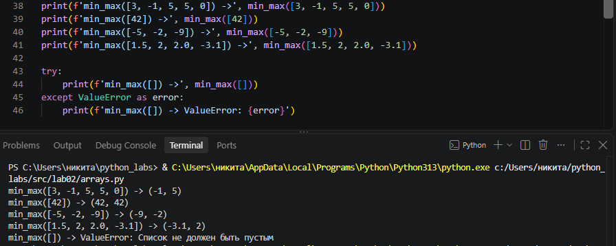
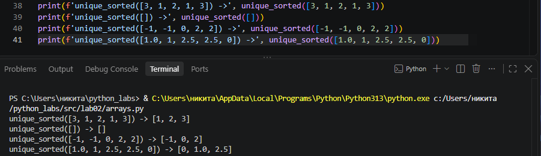
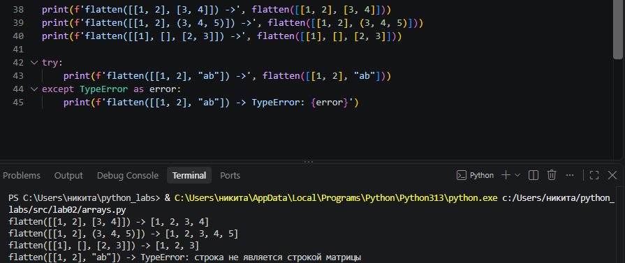
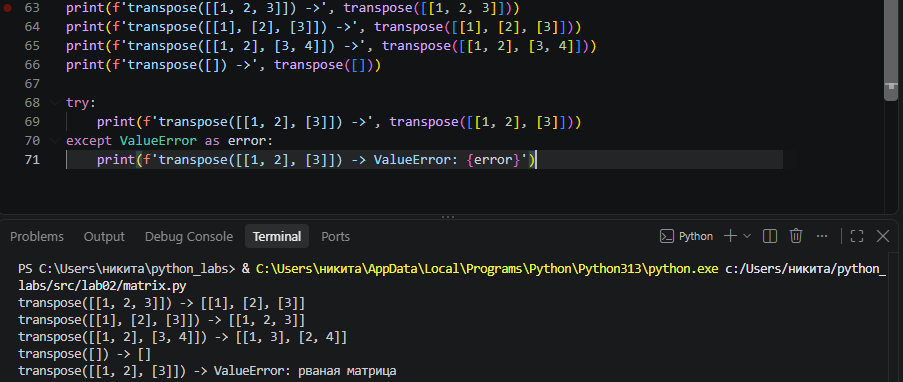
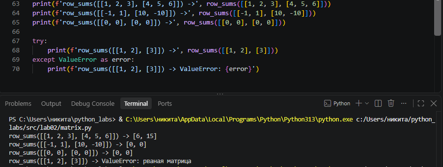
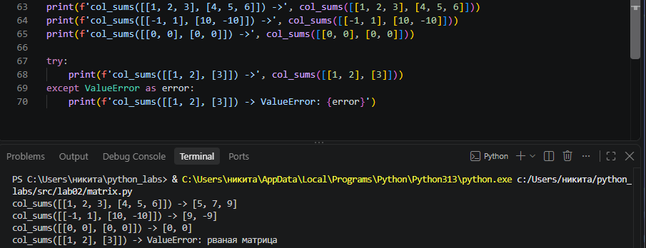
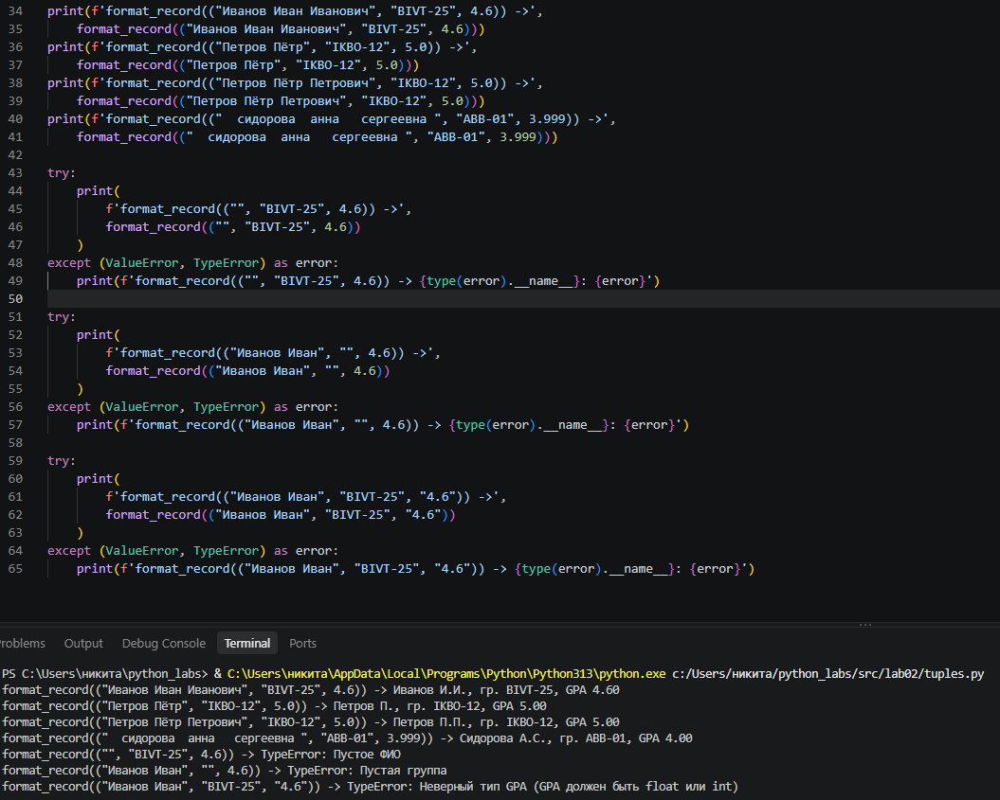

# Задание 1 - arrays.py

Реализованы следующие функции:

min_max() - возвращает минимальное и максимальное значение списка; 
unique_sorted() - возвращает отсортированный список уникальных значений; 
flatten() - преобразует список списков и кортежей в одномерный список. 

## Примеры запуска

### min_max()

### unique_sorted()

### flatten()

# Задание 2 - matrix.py

Реализованы следующие функции:

transpose() - транспонирует матрицу;      
row_sums() - возвращает суммы элементов каждой строки;    
col_sums() - возвращает суммы элементов каждого столбца.    

Все функции работают с прямоугольными матрицами. Если строки имеют разную длину, вызывается ValueError.

## Примеры запуска

### transpose()

### row_sums()

### col_sums()

# Задание 3 - tuples.py

Реализована работа с записями студентов в виде кортежа:

(fio: str, group: str, gpa: float)

Реализованы функции:

initials_fio() - форматирует ФИО и формирует инициалы;      
format_record() - формирует итоговую строку с информацией о студенте. 

## Пример запуска

