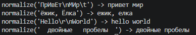
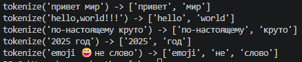
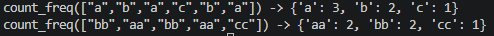
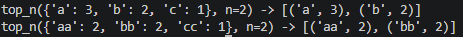
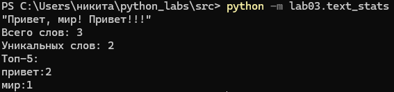
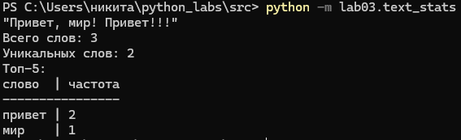

# Задание A - text.py

Реализованы следующие функции:  

normalize() - нормализует текст, приводит его к нижнему регистру и заменяет ё на е;

tokenize() - разбивает текст на список слов;

count_freq() - подсчитывает частоту каждого слова;
 
top_n() - возвращает топ-N самых частотных слов, отсортированных по убыванию частоты.

## Примеры запуска

### normalize()

### tokenize()

### count_freq()

### top_n

# Задание B - text_stats.py (скрипт со stdin)

Реализован следующий файл:

text_stats.py - читает одну строку из stdin, нормализует её, разбивает на слова, подсчитывает частоту слов и выводит общее колиечество слов, количество уникальных слов и топ-5 самых частотных слов. 

! С помощью константы **TABLE_MODE = True/False** можно задавать формат вывода. При TABLE_MODE = True статистика выведется в красивой таблице, где столбец "слово" выровнен по ширине от самого длинного слова. 

## Примеры запуска

### TABLE_MODE = False:

### TABLE_MODE = True:
